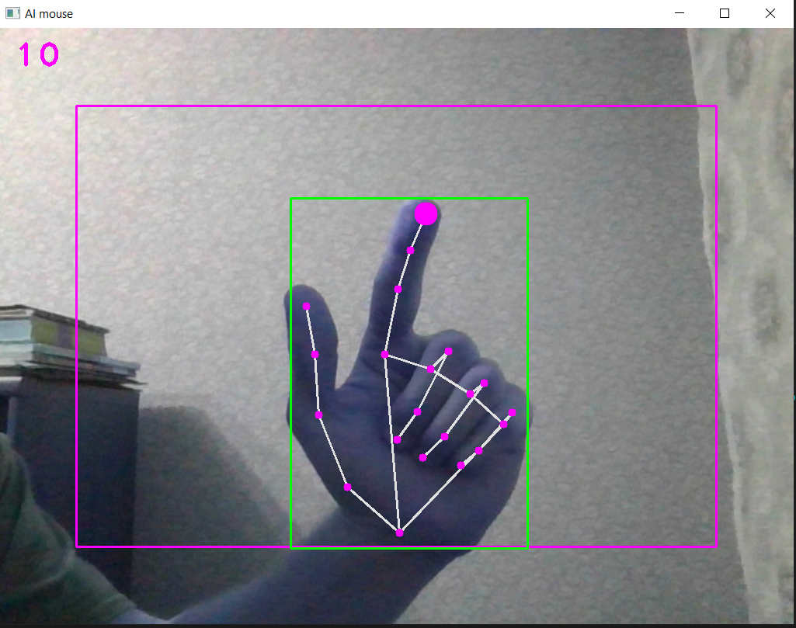

A project based on the mediapipe module and the underlying neural network. The idea is to use a a webcam and a finger to handle the mouse cursor. There 2 modes available:

- move mode with a pointing finger
- click mode with a pointing and a middle finger: you have to touch them.

